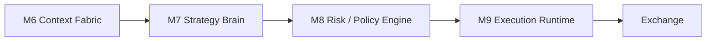

# M7-M9 Draft Plan — Strategy Brain, Risk Engine, Execution Runtime

## Status

Draft from architecture dialogue on 2026-03-12.

## Purpose

Зафіксувати цільову форму трьох верхніх bot-specific модулів після винесення платформних шарів `M1-M6`.

Цей документ не є детальним TDD implementation plan. Це робочий архітектурний драфт, який фіксує:

- межі відповідальності між `M7`, `M8`, `M9`;
- цільові контракти між ними;
- принципи, які не можна порушувати при реалізації;
- початковий план поетапного впровадження.

## Position in the Architecture

Після того як `M1-M6` дають готовий `DecisionContext`, bot runtime звужується до трьох модулів:



Ключова ідея:

- `M7` вирішує, що бот хоче зробити.
- `M8` вирішує, чи має він право це зробити.
- `M9` вирішує, як це виконати на біржі надійно.

## M7. Strategy Brain

### Purpose

`M7` є bot-specific decision layer. Це вже не платформний модуль, а стратегічний модуль конкретного торгового агента.

### Responsibilities

- прийняти `DecisionContext` від `M6`;
- оцінити opportunity set;
- сформувати `TradeIntent`;
- визначити:
  - `LONG / SHORT / HOLD / CLOSE / REDUCE / ADD`;
  - thesis;
  - horizon;
  - conviction;
  - sizing intent;
  - preferred leverage band;
  - expected invalidation logic;
- за потреби виконувати multi-step reasoning або swarm/debate, але тільки в межах strategy decision.

### Must Not Do

- не збирає новини;
- не роутить моделі й не керує LLM keys;
- не читає напряму сирий ринок у 5 різних місцях;
- не виконує фінальні risk constraints;
- не ставить ордери;
- не підміняє собою `M8` або `M9`.

### Inputs

- `DecisionContext`
- strategy configuration
- active strategy mode
- recent bot outcomes / local tactical memory

### Outputs

```ts
interface TradeIntent {
  pair: string;
  action: 'LONG' | 'SHORT' | 'HOLD' | 'CLOSE' | 'REDUCE' | 'ADD';
  confidence: number;
  thesis: string;
  timeHorizon: 'scalp' | 'intraday' | 'swing';
  sizingIntent?: {
    mode: 'fixed_pct' | 'conviction_weighted' | 'volatility_scaled';
    targetPct?: number;
  };
  leverageIntent?: {
    min?: number;
    max?: number;
    preferred?: number;
  };
  invalidationHint?: string;
  contextRef?: string;
}
```

### Design Notes

- `M7` повинен бути thin enough, щоб його можна було тестувати на replay-наборах.
- `M7` може бути LLM-heavy, але output має бути строго структурованим.
- `M7` повинен мислити в термінах opportunity quality, а не exchange mechanics.

## M8. Risk / Policy Engine

### Purpose

`M8` є жорстким policy gate між strategy і execution.

### Responsibilities

- перевіряти кожен `TradeIntent`;
- накладати hard constraints;
- робити portfolio-aware validation;
- масштабувати або забороняти intent;
- генерувати пояснюваний `RiskDecision`.

### Responsibilities in Detail

- leverage caps;
- margin and exposure limits;
- drawdown limits;
- session/day/week loss controls;
- correlation caps;
- concentration caps;
- min confidence policy;
- stale data policy;
- emergency modes / shutdown policy;
- allowed-action policy for degraded modes.

### Must Not Do

- не генерує стратегію;
- не пише ринкову thesis;
- не ставить ордери;
- не приховує reject reason.

### Inputs

- `TradeIntent`
- canonical account state
- current exposure map
- exchange capability constraints
- runtime safety state

### Outputs

```ts
interface RiskDecision {
  status: 'APPROVED' | 'REJECTED' | 'RESIZED' | 'DEFERRED';
  reasonCode?: string;
  message?: string;
  approvedIntent?: ExecutableIntent;
  adjustments?: Array<{
    field: string;
    before: unknown;
    after: unknown;
    why: string;
  }>;
}

interface ExecutableIntent {
  pair: string;
  action: 'LONG' | 'SHORT' | 'CLOSE' | 'REDUCE' | 'ADD';
  sizePct?: number;
  leverage?: number;
  stopLossPolicy?: string;
  takeProfitPolicy?: string;
  thesis: string;
}
```

### Design Notes

- `M8` має бути максимально deterministic.
- Будь-яка “магія” тут з часом стане джерелом важких production bugs.
- Кожне `REJECTED` або `RESIZED` рішення має бути audit-friendly.

## M9. Execution Runtime

### Purpose

`M9` відповідає за надійне виконання дозволених рішень на біржі.

### Responsibilities

- перетворити `ExecutableIntent` в exchange-specific order plan;
- поставити entry/exit orders;
- перевірити success/failure кожного кроку;
- забезпечити idempotency;
- обробити partial fill / reject / timeout;
- синхронізувати execution state з account state;
- логувати lifecycle execution.

### Responsibilities in Detail

- market vs limit entry policy;
- SL/TP placement;
- cancel/replace flows;
- reduce-only closes;
- reconciliation after failure;
- fallback close logic;
- execution telemetry.

### Must Not Do

- не вигадує стратегію;
- не міняє risk policy;
- не ховає exchange failure під виглядом success.

### Inputs

- `ExecutableIntent`
- exchange state
- order precision / limits
- execution policy config

### Outputs

```ts
interface ExecutionResult {
  status: 'FILLED' | 'PARTIAL' | 'REJECTED' | 'FAILED' | 'ABORTED';
  pair: string;
  action: string;
  orderIds: string[];
  fillPrice?: number;
  filledQty?: number;
  slPlaced?: boolean;
  tpPlaced?: boolean;
  message?: string;
}
```

### Design Notes

- `M9` має бути максимально boring and reliable.
- Це не місце для “розумності”; це місце для safety, repeatability і recovery.
- Саме тут живе найкритичніша інтеграційна логіка з біржею.

## Contracts Between M7, M8, M9

### M7 -> M8

Контракт повинен описувати бажану дію, а не exchange-specific деталі.

Правильний рівень абстракції:

- pair
- intent
- confidence
- thesis
- sizing intent
- leverage intent
- invalidation hint

Неправильний рівень абстракції:

- конкретні Binance params;
- точні order flags;
- transport details.

### M8 -> M9

Контракт вже повинен бути executable-grade.

Тут уже допускається:

- allowed side;
- bounded leverage;
- bounded size;
- explicit stop/take policy;
- close behavior;
- degraded mode policy.

## Failure Boundaries

### If M7 fails

- бот не приймає нові strategy decisions;
- `M8` і `M9` все ще можуть закривати або керувати вже відкритими позиціями через safety paths.

### If M8 fails

- нові entries не виконуються;
- execution дозволений тільки для pre-approved emergency actions.

### If M9 fails

- бот не повинен вважати trade successful;
- failure йде в telemetry;
- запускається reconciliation або emergency close path.

## Minimal Rollout Plan

### Phase 1

Описати контракти:

- `DecisionContext`
- `TradeIntent`
- `RiskDecision`
- `ExecutableIntent`
- `ExecutionResult`

### Phase 2

Виділити `M8` з поточного коду як найбільш deterministic частину.

Причина:

- risk rules вже природно піддаються формалізації;
- це найменш креативний і найважливіший gate.

### Phase 3

Виділити `M9` як окремий execution runtime зі строгою telemetry та reconciliation model.

### Phase 4

Перебудувати поточний strategy layer у `M7`, уже поверх `M6 Context Fabric`.

### Phase 5

Додати replay/evaluation harness specifically for `M7`, не змішуючи його з exchange execution.

## Practical Recommendation

Порядок реалізації має бути не `M7 -> M8 -> M9`, а:

1. `M8`
2. `M9`
3. `M7`

Чому:

- strategy можна міняти багато разів;
- risk та execution мають бути стабільним каркасом;
- без стабільних `M8/M9` будь-який новий `M7` буде просто ще одним небезпечним експериментом.

## Open Questions

- Чи буде `M7` одним модулем, чи окремо `Strategy Brain` + `Portfolio Allocator`?
- Чи `M8` має право auto-resize intent, чи лише approve/reject?
- Чи `M9` повинен мати власний emergency mode без участі `M7`?
- Як далеко виносити `position management`: у `M7`, `M8`, чи в окремий підмодуль `M9`?

## Summary

`M7-M9` це не “ще три сервіси”, а чисте ядро майбутнього торгового runtime.

- `M7` думає про trade decision.
- `M8` думає про permission and safety.
- `M9` думає про reliable execution.

Якщо ці межі не розвести жорстко, нова архітектура дуже швидко знову скотиться в монолітний `TradingLoop`, тільки під іншими назвами.
