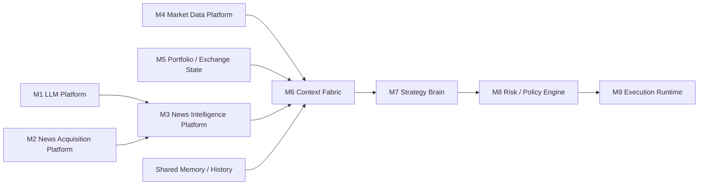

# Платформна модульна архітектура для Indic Bot

## Мета

Винести ключові інтелектуальні та data-intensive частини поточної системи з монолітного бота в окремі платформні модулі, не ламаючи торговий runtime одразу. Ціль не в "переписати все", а в тому, щоб відокремити platform reasoning, content processing, market/context assembly та bot-specific decisioning.

## Поточний стан системи

Підтверджено з коду:

- `src/index.ts` піднімає один Node.js процес, у якому живуть `TradingLoop`, `Watchdog`, Express webhook, LLM-клієнти, news ingestion, risk, execution.
- `src/trading-loop.ts` поєднує кілька різних відповідальностей: fetch ринку, аналіз новин, prompt assembly, strategy reasoning, risk validation, execution orchestration.
- `src/llm/*` зараз не є платформою; це вбудований клієнтський шар усередині бота.
- `src/news/*` зараз теж не є платформою; ingestion, cache, analysis та grounding викликаються з того ж runtime.
- `src/binance/market-data.ts`, `src/watchdog.ts`, user stream та execution працюють як частини того ж процесу.
- Стан системи розподілений між `~/.indic-bot/*`, JSONL-логами, Postgres/Supabase та in-memory структурами.

### Сильні сторони поточного підходу

- Швидка еволюція: нову поведінку можна додати в один кодовий контур.
- Низька інтеграційна складність: немає окремих міжсервісних контрактів.
- Уже реалізовано багато доменного знання: fallback layers, risk guards, watchdog, journaling, position context.

### Обмеження поточного підходу

- `TradingLoop` став `god object`, у якому змішані platform concerns і bot concerns.
- LLM/news/market reasoning не можна незалежно масштабувати, спостерігати чи деплоїти.
- Частина critical state живе в пам'яті процесу, а не в чітких модулях.
- Повторне використання logic для інших ботів або сервісів майже неможливе.

## Цільова архітектурна ідея

Бот має перестати бути "єдиним мозком". Замість цього він стає одним із споживачів платформних модулів.

Принципи:

- Кожен модуль має свою чітку відповідальність і свій контракт.
- `LLM platform` не знає про трейдинг.
- `News intelligence` не приймає торгових рішень.
- `Strategy brain` не займається ingestion, model routing чи сирою нормалізацією даних.
- `Risk` і `execution` не повинні бути прихованими побічними ефектами всередині reasoning-шару.

## Ланцюжок модулів

## Опис модулів

### M1. LLM Platform

Призначення:

- Єдина платформна точка доступу до моделей і reasoning-runtime.

Відповідальність:

- routing між моделями та провайдерами;
- ключі, токени, quotas, retries, rate limiting;
- session/chat management;
- inference caching;
- structured outputs;
- audit trail усіх inference calls;
- policy-level параметри типу `cheap`, `fast`, `deep`, `specific_model`.

Не повинно робити:

- знати про новини, трейдинг, позиції або Binance;
- приймати торгові рішення від свого імені.

Типовий API:

- `POST /inference`
- `POST /reasoning-session`
- `GET /models`
- `GET /inference/:id`

Поточний код, який можна переосмислити як основу:

- `src/llm/client.ts`
- `src/llm/fallback-client.ts`
- `src/llm/grok-client.ts`
- `src/llm/oauth.ts`
- `src/llm/token-pool.ts`

### M2. News Acquisition Platform

Призначення:

- Збирання сирого контенту з різних джерел.

Відповідальність:

- RSS ingestion;
- external news/search APIs;
- source adapters;
- normalization;
- dedup на рівні сирого контенту;
- provenance: звідки взята новина, коли, з яким URI, яким fetcher'ом.

Не повинно робити:

- semantic reasoning про важливість чи вплив;
- приймати рішення, чи новина trading-relevant.

Типовий API:

- `POST /ingest/rss`
- `POST /ingest/provider`
- `GET /articles`
- `GET /sources/health`

Поточний код, який можна винести:

- `src/news/rss-fetcher.ts`
- `src/news/news-fetcher.ts`
- `src/news/news-db.ts`
- `src/news/news-cache.ts`
- `src/news/source-health.ts`

### M3. News Intelligence Platform

Призначення:

- Перетворити сирий контент на decision-grade news intelligence.

Відповідальність:

- importance scoring;
- novelty scoring;
- entity/ticker mapping;
- catalyst extraction;
- grounding / verification;
- contradiction detection;
- summary та narrative compression;
- news-to-market interpretation.

Залежності:

- бере сирий контент із `M2`;
- використовує `M1` для reasoning, коли це потрібно.

Не повинно робити:

- приймати фінальне торгове рішення;
- напряму торкатися execution.

Типовий API:

- `POST /news/analyze`
- `GET /news/signals`
- `GET /news/brief`
- `GET /news/event/:id`

Поточний код, який можна використати:

- `src/news/news-analyst.ts`
- `src/news/grok-grounder.ts`
- `src/news/news-market-fusion.ts`
- `src/news/flash-crash.ts`
- `src/news/grok-macro.ts`

### M4. Market Data Platform

Призначення:

- Дати канонічний доступ до ринкових даних.

Відповідальність:

- ticker/snapshot API;
- candles;
- OI, funding, order book, liquidations;
- real-time event stream;
- derived market features, які є domain-agnostic.

Не повинно робити:

- LLM reasoning;
- strategy-specific висновки типу `LONG`.

Типовий API:

- `GET /market/snapshot/:pair`
- `GET /market/candles/:pair`
- `GET /market/features/:pair`
- `GET /stream/market`

Поточний код, який є базою:

- `src/binance/market-data.ts`
- `src/watchdog.ts`
- `market_snapshots` у DB-шарі

### M5. Portfolio / Exchange State Platform

Призначення:

- Канонічний стан акаунта, позицій, ордерів та fills.

Відповідальність:

- balance, margin, positions, open orders, fills;
- reconciliation між біржею та внутрішнім станом;
- user stream ingestion;
- read-model для bot/runtime шарів.

Не повинно робити:

- strategy reasoning;
- news reasoning;
- ризикові policy-рішення.

Типовий API:

- `GET /account/state`
- `GET /account/positions`
- `GET /account/orders`
- `GET /account/fills`

Поточний код, який логічно входить сюди:

- `marketData.getPortfolioState()`
- Binance user stream, який стартує з `src/index.ts`
- reconciliation logic навколо позицій

### M6. Context Fabric

Призначення:

- Зшити все відоме в один decision context.

Відповідальність:

- збір `M3 + M4 + M5 + memory/history`;
- уніфікований `DecisionContext` контракт;
- compact context views для різних споживачів;
- policy-neutral signal fusion.

Важливо:

- це не ще один "великий LLM-мозок";
- допускається lightweight fusion logic, але не фінальне рішення `LONG/SHORT/HOLD`.

Типовий API:

- `GET /context/trading`
- `GET /context/news-aware`
- `GET /context/pair/:pair`

Поточний код, який зараз розмазаний по моноліту:

- prompt/context assembly в `src/trading-loop.ts`
- watchdog summary
- position context lookup
- news-market fusion insertion into prompt
- episodic memory injection

### M7. Strategy Brain

Призначення:

- Bot-specific торгове рішення.

Відповідальність:

- створити thesis;
- вибрати `LONG / SHORT / HOLD / CLOSE`;
- визначити horizon, conviction, sizing intent;
- працювати тільки на готовому `DecisionContext`.

Важлива межа:

- цей модуль уже знає, що він трейдинг-бот;
- але він не повинен повторно вирішувати завдання `M1`, `M2`, `M3`, `M4`, `M5`.

Поточний код:

- основний strategy reasoning у `src/trading-loop.ts`
- `src/llm/swarm-agent.ts`
- `src/llm/agents.ts`
- prompt policies з `src/llm/prompts.ts`

### M8. Risk / Policy Engine

Призначення:

- Дозволити або заборонити рішення `M7`.

Відповідальність:

- leverage caps;
- exposure caps;
- drawdown limits;
- session/daily kill switches;
- regime-based restrictions;
- portfolio-level constraints;
- hard guards перед execution.

Поточний код:

- `src/risk/manager.ts`

### M9. Execution Runtime

Призначення:

- Надійно виконати дозволене рішення на біржі.

Відповідальність:

- place/close orders;
- SL/TP;
- idempotency;
- order retries;
- exchange error handling;
- exact execution reconciliation.

Поточний код:

- `src/binance/orders.ts`
- частина position handling у `src/trading-loop.ts`

## Спільні підсистеми

Це не окремі модулі ланцюжка, але їх потрібно проєктувати одразу:

- `Observability`: inference logs, decision logs, metrics, tracing, alerts;
- `Memory`: episodic memory, historical outcomes, reusable context artifacts;
- `Storage`: Postgres/Supabase, object/file storage, caches;
- `Auth/Security`: service-to-service auth, API keys, secrets, quotas.

## Порівняння: зараз vs цільова модель

| Область | Зараз | Цільова модель |
|---|---|---|
| LLM | Вбудований клієнт у боті | Окрема LLM-платформа |
| Новини | Ingestion і analysis у тому ж runtime | `M2` + `M3` як окремі платформні модулі |
| Market data | Binance fetch усередині бота | Окремий market-data модуль |
| Portfolio state | Читається з runtime напряму | Канонічний account-state модуль |
| Context assembly | Змішаний у `TradingLoop` | Окремий `M6 Context Fabric` |
| Strategy | Змішана з orchestration | Чіткий `M7 Strategy Brain` |
| Risk | Частково окремий, частково розмазаний | Чіткий `M8` перед execution |
| Execution | Прив'язаний до циклу | Окремий `M9` runtime |
| Deployment | Один процес | Кілька незалежних модулів/платформ |

## Як це співвідноситься з поточним кодом

Поточний репозиторій не треба викидати. Він уже є:

- референсною реалізацією бізнес-логіки;
- джерелом edge cases;
- набором готових адаптерів до Binance, OpenAI, Grok, RSS;
- місцем, де вже є risk invariants і реальні production-патерни.

Практично це означає:

- `src/llm/*` можна використати як seed для `M1`;
- `src/news/*` поділити на `M2` і `M3`;
- `src/binance/market-data.ts` і частину `watchdog` використати для `M4`;
- account/positions logic поступово винести в `M5`;
- `TradingLoop` з часом схлопнути до `M6 + M7 orchestration` або ще тоншого bot runtime.

## Рекомендація: rewrite чи reuse

### Висновок

Не робити повний rewrite. Робити поетапну `strangler migration` поверх існуючого коду.

### Чому не rewrite

- Поточний код уже містить доменні інваріанти, які легко загубити при переписуванні.
- "Суперпотужні LLM" прискорюють написання коду, але не гарантують behavioral parity.
- У трейдинговій системі найдорожчі помилки це не синтаксис, а втрачена логіка edge cases.
- Повний rewrite майже напевно створить другий моноліт, тільки новіший.

### Чому reuse + новий код

- Нові платформні модулі можна писати greenfield.
- Але їхні контракти і regression cases треба знімати з чинної системи.
- Поточний бот має стати "джерелом правди" для міграційного етапу.
- LLM варто використовувати для прискорення extraction, refactoring, тестів, контрактів і документації, а не як виправдання для сліпого переписування.

## Невеликий план реалізації

### Фаза 0. Зафіксувати контракти

- описати canonical schemas для `InferenceRequest`, `NewsArticle`, `NewsSignal`, `MarketSnapshot`, `AccountState`, `DecisionContext`, `TradeIntent`;
- визначити, які API синхронні, а які асинхронні;
- визначити межі ownership для кожного модуля.

### Фаза 1. Винести M1

- зібрати standalone `LLM Platform` поверх поточного `src/llm/*`;
- підключити бот до нього через adapter;
- зберегти локальний fallback на час міграції.

### Фаза 2. Винести M2

- зробити окремий ingest runtime для RSS/API;
- уніфікувати storage сирих статей;
- перестати тягнути news ingestion з bot runtime.

### Фаза 3. Побудувати M3

- винести news analysis, grounding і ranking у самостійний модуль;
- бот починає читати готові `news signals`, а не сирі headlines.

### Фаза 4. Винести M4 і M5

- відокремити market snapshots/features;
- окремо відокремити account state та reconciliation;
- бот перестає напряму читати біржу в кількох місцях одночасно.

### Фаза 5. Побудувати M6

- створити канонічний `DecisionContext`;
- зібрати сюди market, news, account, memory;
- прибрати більшість prompt-assembly хаосу з `TradingLoop`.

### Фаза 6. Звузити бот до M7-M9

- бот стає thin runtime: strategy, risk, execution;
- решта knowledge приходить через модульні контракти.

## Архітектурні рішення для першої версії

- Платформи можуть жити в одному репозиторії або в кількох, але контракти мають бути незалежними від бота.
- На першому етапі допустимо, що `M1`, `M2`, `M3` розгортаються "поруч" як одна platform zone.
- `M6 Context Fabric` краще вводити після `M1-M5`, а не раніше.
- `Risk` і `Execution` не треба чіпати першими; це найнебезпечніша частина для rewrite.

## Робочі припущення

- `M5 Portfolio / Exchange State` вважається окремим модулем, а не частиною execution.
- `M7 Strategy Brain` залишається bot-specific, а не платформним сервісом.
- У фазі міграції старий моноліт і нові модулі можуть працювати паралельно.

## Резюме

Правильний напрямок не "винести LLM і новини кудись назовні", а побудувати платформний шар, який відріже platform intelligence від trading runtime. Поточний код варто не переписувати з нуля, а використати як референсну доменну базу і поступово витягувати з нього модулі `M1-M5`, після чого сам бот природно звузиться до `M7-M9`.
